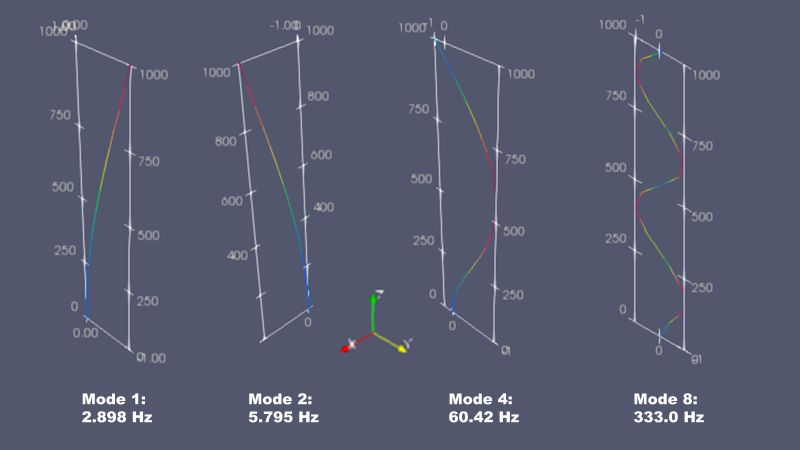

# **Inverted pendulum**

Modal analysis of an inverted pendulum.

## Model specifications

The pendulum is:

* 1 meter long 
* with a mass of 1 kg at the free end, 
* other end is fixed in all three directions (translations and rotations)
* and carries a mass of 1 kg which cannot move at all

The pendulum is rectangular with dimensions *a* by *2a* with  a = 7.9 mm.

Total mass of structure is 3 kg.

Material specifications are:

* E = 210000 MPa
* nu = 0.3
* density = 8e-9 T/mm^3

## Results

